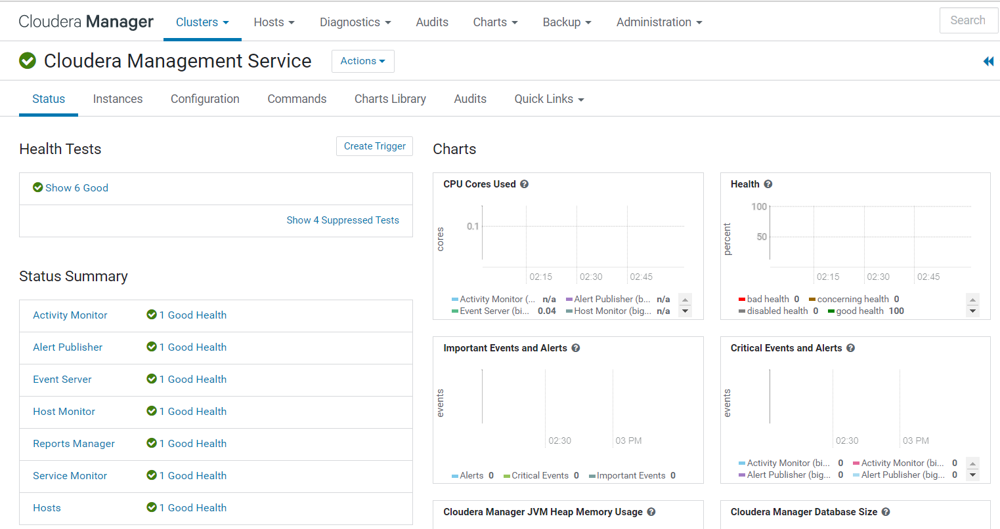

# Cloudera Cluster Automation
This is a working ansible example accompanying the article [CLOUDERA CLUSTER AUTOMATION MIT ANSIBLE (TEIL 2)](https://blog.ordix.de).

## Disclaimer
This repository is only intended for testing and show casing purposes.
Do not use any of the provided components in a production environment.

## General
The playbooks in this repository uses a json template to configure the Cloudera Management Service in an existing Cloudera Manager instance.
After successful playbook run, the Cloudera Management Service including the roles SERVICEMONITOR, HOSTMONITOR, EVENTSERVER, ALERTPUBLISHER, ACTIVITYMONITOR, REPORTSMANAGER are configured and running
This playbook expects an existing and running Cloudera Manager Instance at the in the inventory specified host.

Included in this repository are 3 Cloudera Management Service Templates.

**1. mgmt_service_minimal:** This template adds all roles without special configuration. Manual configuration necessary afterwards. Fails if no valid license is present.

**2. mgmt_service_free:** This template adds and configures all roles except the REPORTSMANAGER as it requires a valid license.

**3. mgmt_service_enterprise:** This template adds and configures all roles. Fails if no valid license is present.

## Usage
The playbook fails safely if there is a Cloudera Management Service already present at the specified Cloudera Manager.
After successful run, the Cloudera Management Service is present, configured and started.
**1. Create Inventory**

Edit the inventory file **inventory.yml** and replace `<hostname>`, `<ip_address>`, `<user>` with the ones of your destination hos
Furthermore the ACTIVITYMONITOR and REPORTSMANAGER database passwords need to be changed accordingly.
If a Cloudera Enterprise oder Trial License is active, it is possible to switch from "mgmt_service_free.json" template to the "mgmt_service_enterprise.json" template.

**2. Execute Ansible Playbooks**

```shell script
ansible -i inventory.yml playbook.yml
```

## Screenshots
**Running Cloudera Management Service**
 


